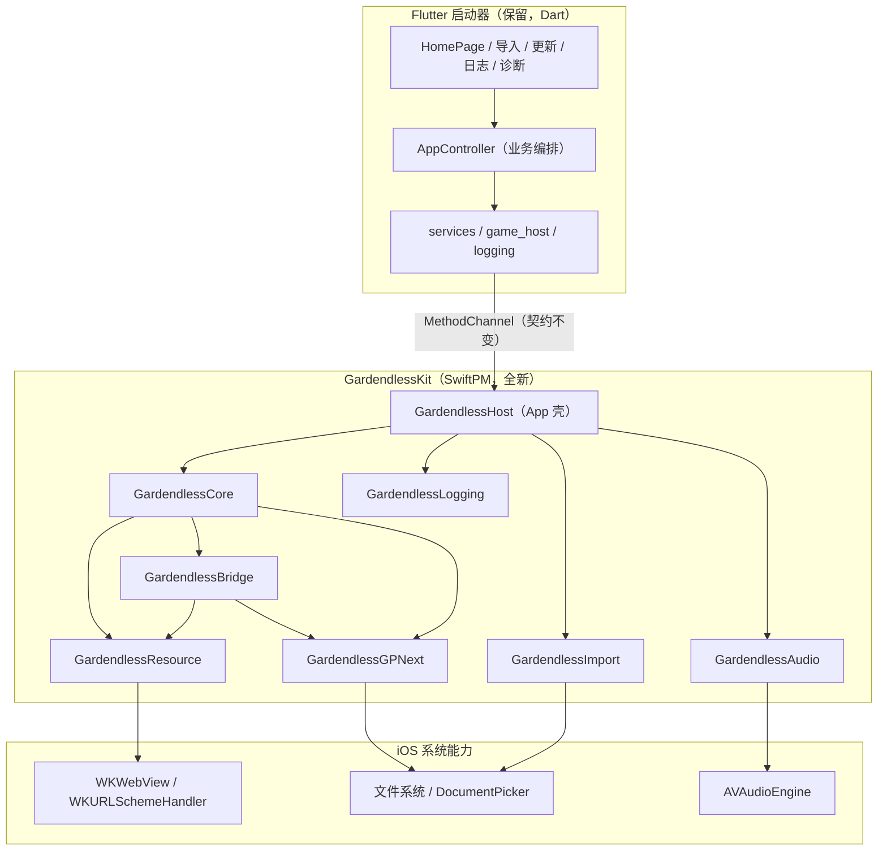

# GardendlessLoader iOS 目标架构

> 状态：已确认（候选 B）
> 日期：2026-08-05
> 分支：`codex/native-sfx-exception-guard`

## 1. 架构概览

产品保持“Flutter 启动器 + 各平台原生 GameHost”的整体形态。iOS 原生层从零重建为本地 SwiftPM 包
`GardendlessKit`，按业务能力划分模块；`ios/Runner` 只保留最薄的 App/引擎壳。

## 2. 设计原则

1. 旧代码只作为行为说明书；不复制旧类名、旧文件布局与旧控制流。
2. 模块按业务能力划分，依赖方向单向：`Core` 不依赖任何上层模块；`Host` 依赖全部能力模块。
3. 显式 I/O 边界：文件访问、WebKit 回调、系统选择器、音频引擎全部收敛到能力模块，业务逻辑不直接触碰。
4. 强类型协议优先；通道消息只在 `Host` 的适配层出现。
5. 最小第三方依赖：仅系统框架（Foundation/UIKit/WebKit/AVFoundation/UniformTypeIdentifiers/zlib）。
6. 保留已确认的产品行为与用户数据；不做无证据的“现代化”改动。

## 3. 模块清单与职责

| 模块 | 职责 | 关键类型（新设计） |
| --- | --- | --- |
| `GardendlessCore` | 会话模型、路径沙箱、网络策略、错误模型、配置 | `GameSession`、`PathSandbox`、`NetworkPolicy`、`GameError`、`GameConfiguration` |
| `GardendlessResource` | 本地资源服务：定位、MIME、Range/ETag、缓存、取消 | `ResourceLocator`、`ResourceSchemeHandler`、`ResourceMetadata`、`AudioResourceCache` |
| `GardendlessBridge` | 页面↔原生消息桥、宿主命令、导出协议 | `ScriptMessageBridge`、`ExportCoordinator`、`BridgeRequest`/`BridgeResponse` |
| `GardendlessImport` | ZIP 流式解析、docs 定位、路径安全、进度事件 | `ZipArchiveReader`、`DocsDirectoryFinder`、`ZipImportSession` |
| `GardendlessGPNext` | GP-Next 沙箱 FS、补丁导入/替换、导出/外链 | `GpNextFileSystem`、`GpNextPackageImporter`、`GpNextCommandRouter` |
| `GardendlessAudio` | 短音效解码/播放、缓存、fallback、异常守卫 | `ShortSfxEngine`、`AudioPlaybackController`、`SfxExceptionGuard` |
| `GardendlessLogging` | JSONL 持久化、脱敏、轮转、快照、删除 | `LogStore`、`LogEventBuilder`、`LogSanitizer` |
| `GardendlessHost` | Flutter 通道适配、App 启动、ViewController 装配 | `LauncherBootstrap`、`GameHostController`、`AppChannelRouter` |

## 4. 依赖方向

- `GardendlessCore`：无内部依赖（Foundation）。
- `GardendlessResource` → Core。
- `GardendlessBridge` → Core、Resource、GPNext（导出/命令路由需要）。
- `GardendlessGPNext` → Core。
- `GardendlessAudio` → Core（定位器/路径）、Logging（可选指标）。
- `GardendlessImport` → Core（错误/路径）。
- `GardendlessLogging`：无内部依赖。
- `GardendlessHost` → 全部能力模块；是唯一与 Flutter/Dart 通道直接交互的模块。

禁止反向依赖；`GardendlessHost` 之外不得 import Flutter。

## 5. 领域模型与数据所有权

| 数据 | 所有者 | 说明 |
| --- | --- | --- |
| `manifest.json`、`slot-a/b`、`.slot-metadata.json` | Dart 启动器 | 不变；iOS 原生只读会话目录 |
| `gp-next/packs|patches` | GardendlessGPNext | 原生读写；路径沙箱锚点 |
| `app_settings.json` | Dart（写）+ GardendlessBridge（水印写） | 保持同一文件与格式 |
| `game_session.json` / `game_exit_result.json` | Dart 写会话、Host 写退出结果 | schema 不变 |
| 日志目录 | GardendlessLogging | Application Support，布局不变 |
| ZIP 导入临时/目标槽 | GardendlessImport（临时）+ Dart（事务状态） | 导入执行仍在原生，事务状态机在 Dart |

## 6. 公共契约（保留，不视为可破坏项）

- 四个 MethodChannel 名称与消息形态不变（resource_zip_importer / game_host / external_browser / app_logger）。
- `GameSession` JSON schema v1、退出结果 schema v1、日志事件 schema v1。
- `gardendless-game://localhost` Origin、入口 `?generation=N`、资源处理器行为矩阵（GET/HEAD/Range/ETag/MIME/取消/路径安全）。
- JS 桥命令面（host:* 与 gp-next 命名空间）与 `assets/game_bridge/*.js` 注入顺序。
- 用户可见行为与验收清单（触摸矩阵、自动收集、水印、导出、GP-Next 规则）。

## 7. 有意改变的内部结构（Breaking Changes 摘要）

- `ios/Runner/*.swift` 旧实现不再编译；新实现位于 `ios/GardendlessKit/Sources/*`。
- `ios/Package.swift` 从“核心测试包”升级为正式产品包（含 app 壳依赖目标）。
- Xcode 工程增加对 `GardendlessKit` 的本地 SwiftPM 依赖；Runner 源码大幅瘦身。
- 原生错误码统一命名（`GameError.Code`），Dart 适配层只映射不变的用户可见文案。
- CI iOS job 增加 `swift test`（GardendlessKit）门禁。
- 详细清单见 `docs/breaking-changes.md`（Phase 7 完善）。

## 8. 错误 / 并发 / 配置 / 日志模型

- 错误：`GameError`（code + message + underlying），能力模块抛类型化错误，Host 适配层转通道错误；用户可见文案保持中文不变。
- 并发：资源队列有界（6）、音频解码串行（1）、日志串行队列、GP-Next 命令串行；所有跨队列状态用串行队列或锁保护，禁止无界异步堆积。
- 配置：`GameConfiguration` 集中管理（origin、限额、超时、缓存上限）；`UserDefaults.nativeSfxEnabled` 保留。
- 日志：由 `GardendlessLogging` 统一实现；Dart/JS 事件仍走既有通道与注入脚本，格式 schema v1 不变。

## 9. 构建 / 测试 / 发布

- 本地：`swift build` / `swift test`（Kit）+ `flutter analyze` / `flutter test`（启动器）+ `flutter build ios --release --no-codesign`。
- CI：iOS job 先 `swift test`，再 Flutter 测试，再 unsigned IPA。
- 发布：保持现有流程（版本同步、announcements、draft PR），不新增部署目标。

## 10. 非目标

- 不改 Dart 业务架构（除非通道契约必需的最小适配）。
- 不改 Android / OHOS 原生层。
- 不迁移 WebKit localStorage/IndexedDB（Origin 不变，天然保留）。
- 不引入新第三方依赖。
